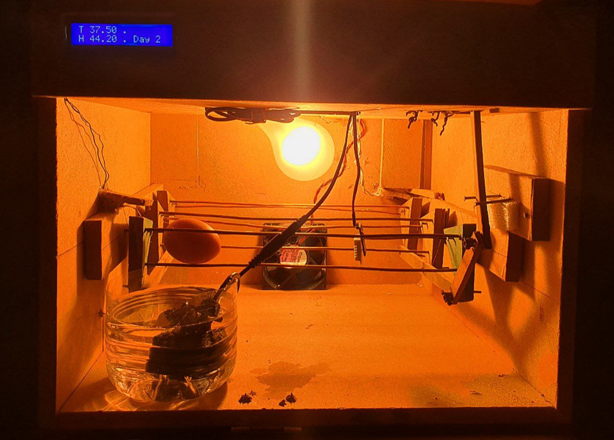
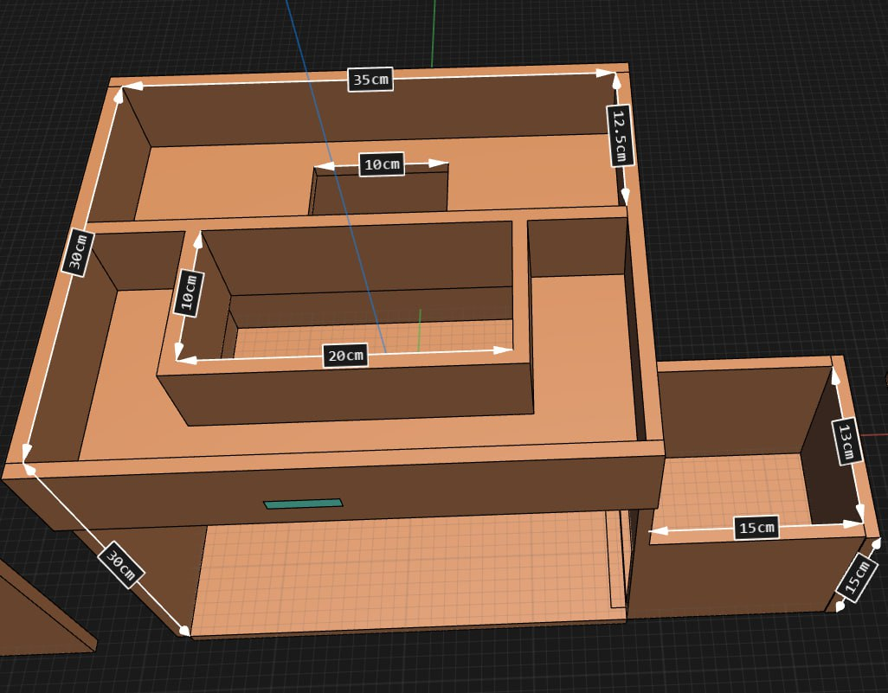
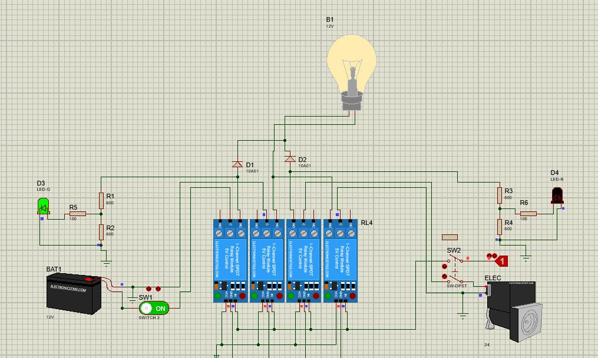

# ESP32 Powered Smart Egg Incubator 🥚

Welcome to the official repository for my **ESP32 Powered Smart Egg Incubator**.  
This project is part of my academic final-year work and demonstrates IoT, embedded systems, and automated hardware control.
---

## 🔹 Project Overview

Traditional egg incubators require manual monitoring of temperature and humidity, which can be inconsistent and lead to poor hatch rates.  
This project automates the incubation process using an **ESP32 microcontroller** and sensors, ensuring optimal conditions for egg hatching.

### 📸 Incubator Overview


---

## 🔹 Key Features

- Automatic temperature regulation  
- Automatic humidity control  
- Real-time monitoring via IoT  
- Alerts for out-of-range conditions  
- Compact and energy-efficient design  

---

## 🛠️ Tech Stack & Components

### Hardware
- ESP32 microcontroller  
- DHT22 Temperature & Humidity Sensor  
- Relay module (for heater/humidifier control)  
- Power supply & enclosure  
- Incubator tray with eggs  

### 📸 Hardware Setup


### Software / Firmware
- Embedded C / Arduino IDE  
- ESP32 Wi-Fi library  
- Optional: Mobile/web dashboard for monitoring  



---

## 🔹 System Architecture
The overall system architecture:

```text
Eggs → Incubator Tray → Sensors (Temp/Humidity) → ESP32 → Relay → Heater / Humidifier
                   ↘ Wi-Fi → Monitoring Dashboard (optional)